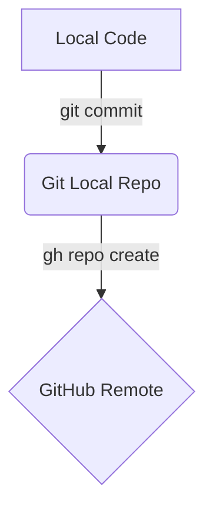

# Markdown Cheatsheet 📝

A quick reference guide for writing and formatting Markdown files.

---

## 1. Headers

# Heading 1 (`#`)

## Heading 2 (`##`)

### Heading 3 (`###`)

#### Heading 4 (`####`)

---

## 2. Text Formatting

| Style | Syntax | Output |
| :--- | :--- | :--- |
| **Bold** | `**text**` or `__text__` | **text** |
| *Italic* | `*text*` or `_text_` | *text* |
| ***Bold & Italic*** | `***text***` | ***text*** |
| ~~Strikethrough~~ | `~~text~~` | ~~text~~ |
| `Inline Code` | `` `code` `` | `code` |

---

## 3. Lists

### Unordered List

```markdown
- Item 1
- Item 2
  - Sub-item 2.1
  - Sub-item 2.2
```

# Markdown Advanced Guide 📝

A comprehensive guide covering core syntax, GitHub Flavored Markdown (GFM), HTML integration, diagrams, and math equations.

---

## 1. GitHub Callouts / Alerts (提示块)

> [!NOTE]
> Useful information that users should know, even when skimming.

> [!TIP]
> Helpful advice for doing things better or more easily.

> [!IMPORTANT]
> Key information users need to know to achieve their goal.

> [!WARNING]
> Urgent info that needs immediate user attention to avoid problems.

> [!CAUTION]
> Advises about risks or negative outcomes of certain actions.

---

## 2. Footnotes & Collapse Blocks (折叠与脚注)

### Footnotes (脚注)

Here is a sentence with a footnote reference[^1].

[^1]: This is the text explaining the footnote.

### Collapsible Section (折叠/展开代码)

<details>
<summary>Click to expand long code / logs</summary>

```bash
# Long output or command here
npm run build --verbose
```

</details>

---

## 3. Advanced Tables & Alignment (表格增强)

| Feature | Left-Aligned | Center-Aligned | Right-Aligned |
| :--- | :--- | :---: | ---: |
| Syntax | `:---` | `:---:` | `---:` |
| Price | $10.00 | $10.00 | $10.00 |

---

## 4. Mathematics & Formulas (LaTeX Math)

Inline formula: $E = mc^2$ or $\lim_{x \to 0} \frac{\sin x}{x} = 1$

Block formula:
$$\frac{\partial f}{\partial x} = \lim_{h \to 0} \frac{f(x+h, y) - f(x, y)}{h}$$

---

## 5. Mermaid Diagrams (流程图与时序图)



---

## 6. HTML & Media Embedding (HTML 嵌入与控制)

### Image Alignment & Size


This text wraps around the right-aligned image. You can specify precise width and height in pixels using normal HTML standard tags.

<br clear="both" />

### Keyboard Shortcuts Styling

Press <kbd>Cmd</kbd> + <kbd>Shift</kbd> + <kbd>P</kbd> to open VS Code Command Palette.

---

## 7. Special Symbols & Escaping (转义字符)

Use `\` to print literal Markdown formatting characters:

- \*Not italic\*
- \# Not a header
- \`Not code\`
